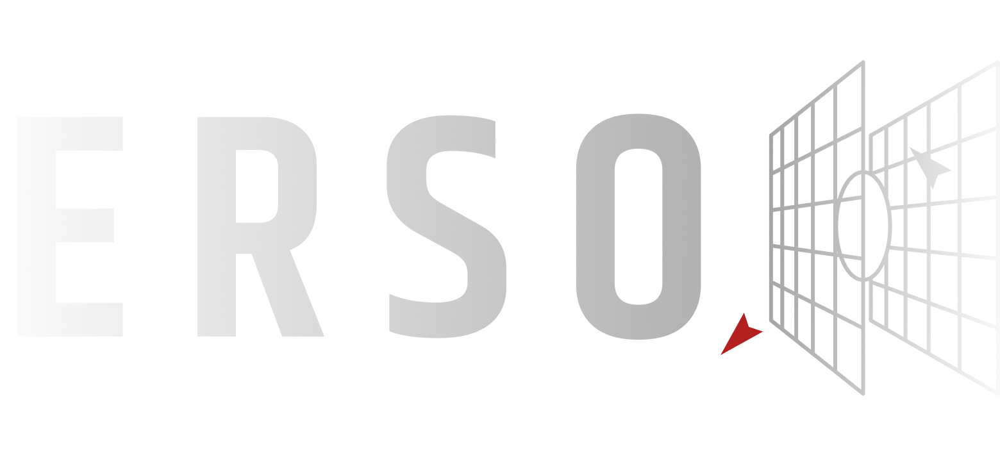

---

Erso is a C++20/OpenGL graphics engine. Deferred PBR pipeline, ECS, frustum culling, shader hot-reload, ImGui overlay. 

OpenGL 4.1 on macOS (driver ceiling), 4.6 elsewhere.

## Building

```sh
cmake -B build -S engine
cmake --build build
./build/engine
```

All dependencies (GLFW, GLAD2, GLM, Assimp, ImGui, stb) are pulled via `FetchContent` — nothing to install manually. The asset path is baked in at compile time so the binary works from any working directory.


## Pipeline

Every frame runs four passes in fixed order:

**1. Shadow** — Depth-only, 2048×2048, rendered from the directional light's perspective. Produces the `LightSpaceMatrix` that the lighting pass uses for PCF shadow sampling.

**2. Geometry (G-Buffer)** — Fills three MRT textures: `RGBA16F` world-space normals, `RGBA8` albedo, `RGBA8` metallic/roughness/AO. Normals are read from a tangent-space normal map and transformed to world space via a per-vertex TBN. Hardware depth is shared with the next pass.

**3. Lighting** — Fullscreen triangle; no mesh draw. Reconstructs world-space position from depth + `invViewProjection`, then evaluates Cook-Torrance (GGX NDF, Smith-correlated G term, Fresnel-Schlick) for one directional light. PCF shadows, hemisphere ambient with AO. Output: `RGB16F` HDR.

**4. Post-process** — Three stages: luminance-threshold bloom (dual-Kawase blur at half res) composited by the ACES filmic tonemapper with γ 2.2 correction, then FXAA. Output: `RGBA8` LDR, blitted to the swapchain by the application.


## Renderer internals worth knowing

**Mega-buffer.** All mesh geometry shares one VAO. `MeshBuffer` is a bump-pointer allocator over a single VBO + IBO; each mesh gets `(baseVertex, baseIndex)` offsets and draws with `glDrawElementsBaseVertex`. No VAO switches mid-frame.

**UBOs.** Three std140 blocks: `PerFrameData` (binding 0, 288 B — matrices, camera pos, resolution, time), `PerObjectData` (binding 1, 128 B — model + normal matrix), `ShadowData` (binding 2, 96 B — light-space matrix, light params). Static asserts check C++ struct sizes match GLSL.

**Shader hot-reload.** `ResourceManager::TrackShaderForReload()` records source file mtimes. `PollShaderReload()` called once per frame; on a mtime change it recompiles and silently keeps the old program if compilation fails.

**GL boundary.** No `GL_*` constants or `gl*` calls above `renderer/backend/`. Everything above that layer talks to typed C++ objects.

## ECS

`Registry` stores components as `std::unordered_map<std::type_index, std::any>` per entity. Not cache-friendly, but straightforward to extend. `Each<Ts...>(fn)` iterates all entities that have all listed component types.

Built-in components: `TransformComponent`, `MeshComponent`, `CameraComponent` (perspective and orthographic), `DirectionalLightComponent`, `PointLightComponent`.

`CameraSystem` supports both projections — set `CameraComponent::isOrthographic` and `orthoHeight`; the rest of the pipeline (G-Buffer, lighting, frustum culling) is projection-agnostic.

`RenderSystem::GatherCommands` extracts a six-plane frustum from `viewProjection`, tests each entity's local AABB against it in world space, and submits surviving entities as `RenderCommand`s to the `RenderQueue`.

## Debug tooling

`DebugRenderer` batches line geometry (up to 65 536 verts) into a single draw call. `DrawLine`, `DrawAABB`, `DrawSphere`, `DrawFrustum` — all cleared by `FlushAndClear` at the end of the frame.

`GPUTimer` wraps async `GL_TIME_ELAPSED` queries. `Begin(label)` / `End(label)` around any work; `CollectResults()` reads back without stalling.

The ImGui overlay shows per-pass GPU timings, frustum cull stats, live G-buffer texture previews, and a directional light inspector with runtime-editable direction/color/intensity.

## Shaders

All GLSL is under `engine/assets/shaders/`. `ShaderPreprocessor` handles `#include` resolution relative to that root, so the shared files in `common/` (UBO declarations, BRDF functions, PCF helpers) can be included freely.
